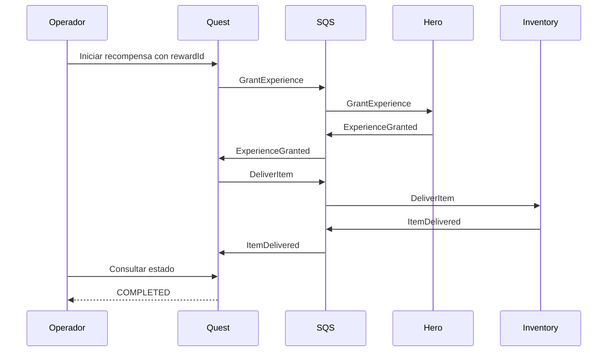

# Distributed Realms: laboratorio de consistencia y recuperación

## 1. Propósito

Distributed Realms es un laboratorio para aprender sistemas distribuidos en profundidad. Usa una recompensa de misión RPG como contexto concreto para estudiar consistencia, mensajería, fallos parciales y recuperación. No busca construir un RPG funcional ni enseñar programación.

El usuario tiene experiencia con backend, colas y servicios. El aprendizaje se concentra en las garantías de cada estrategia y en la evidencia que permite comprobarlas.

Cada laboratorio debe incluir una predicción, un fallo reproducible, observaciones del estado y un criterio verificable de resultado.

## 2. Alcance acordado

El primer laboratorio procesa una misión ya cumplida que concede una cantidad fija de XP y un objeto. No incluye objetivos de misión, combate, clases, habilidades, niveles ni interfaz de juego. El inventario tiene capacidad suficiente.

Reglas de negocio:

- Una recompensa tiene un `rewardId` estable y pertenece a un héroe.
- Cada recompensa concede XP una sola vez y entrega un objeto una sola vez.
- Si la XP fue concedida, un fallo posterior no la revierte.
- La entrega del objeto permanece pendiente hasta completarse.
- Los estados intermedios son válidos y deben ser observables.
- La finalización supone que los participantes y la infraestructura se recuperan y que la publicación y el procesamiento pendientes siguen ejecutándose.

La coordinación se implementa como una saga orquestada con recuperación hacia adelante. Las compensaciones se explorarán en un laboratorio posterior con operaciones que tengan una reversión de negocio definida.

## 3. Stack y ejecución

- Java 25 y Spring Boot 4 para los tres servicios.
- Floci como emulador AWS local.
- DynamoDB para persistencia.
- SQS para comandos y eventos de resultado.
- Un repositorio y tres procesos que puedan detenerse y reiniciarse de forma independiente.

Antes de implementar se comprobarán las versiones compatibles de las dependencias y las operaciones de DynamoDB y SQS requeridas en Floci. El emulador no constituye evidencia de equivalencia completa con AWS.

EventBridge y SNS quedan para experimentos posteriores de enrutamiento y distribución a varios consumidores. Event Sourcing y CQRS no son requisitos del primer laboratorio: la persistencia de la saga y de los resultados procesados debe permitir estudiar recuperación sin añadir esas variables desde el inicio.

## 4. Participantes y propiedad del estado

| Servicio | Responsabilidad | Estado persistido propio |
| --- | --- | --- |
| Quest | Crear la recompensa, coordinar sus pasos y registrar su finalización | Recompensa, estado de saga y mensajes procesados |
| Hero | Conceder XP y reconocer solicitudes repetidas | XP del héroe y resultado de cada recompensa procesada |
| Inventory | Entregar el objeto y reconocer solicitudes repetidas | Objetos entregados y resultado de cada recompensa procesada |

Cada servicio accede únicamente a sus tablas. Compartir una instancia local de DynamoDB no autoriza a consultar o modificar las tablas de otro participante.

Quest ofrece HTTP para iniciar una recompensa y consultar su estado. Las consultas de XP e inventario se realizan mediante las APIs de sus servicios. Las inspecciones directas de tablas se reservan para las herramientas del laboratorio.

## 5. Mensajes y flujo

Se emplean colas SQS Standard para hacer explícita la necesidad de tolerar reentregas y ausencia de orden global:

- `hero-commands`: comandos para Hero.
- `inventory-commands`: comandos para Inventory.
- `quest-results`: eventos de resultado para Quest.

Cada cola tendrá su propia DLQ para aislar mensajes que no puedan procesarse tras los intentos configurados. Un retraso o un servicio temporalmente caído no equivale a una cancelación de negocio. Los errores de negocio y los mensajes malformados deben distinguirse de los errores técnicos transitorios.

Flujo:

1. Quest registra la recompensa en `XP_PENDING` y solicita `GrantExperience`.
2. Hero concede la XP y emite `ExperienceGranted`.
3. Quest registra `ITEM_PENDING` y solicita `DeliverItem`.
4. Inventory entrega el objeto y emite `ItemDelivered`.
5. Quest registra `COMPLETED`.

El diagrama describe el flujo lógico; las garantías de persistencia y publicación dependen de la versión del laboratorio.

Sobre mínimo de cada mensaje:

- `messageId`: identidad estable del mensaje lógico, conservada al reintentar su publicación.
- `type` y `schemaVersion`: contrato del mensaje.
- `rewardId`: identidad de la operación de negocio y correlación de la saga.
- `causationId`: mensaje que originó esta respuesta o comando, cuando corresponda.
- `occurredAt`: instante de creación.
- `payload`: héroe, cantidad de XP u objeto según el contrato.

Un identificador de transporte SQS no sustituye a `messageId` ni a `rewardId`. Reutilizar un `rewardId` con datos de recompensa distintos debe producir un conflicto explícito.

## 6. Versión vulnerable: lab-01-vulnerable

Se conserva mediante una etiqueta Git, junto con instrucciones y herramientas que permitan reproducir el fallo.

La implementación confirma la escritura de negocio y luego publica el mensaje en una operación separada. No tiene un registro durable de publicaciones pendientes ni un recuperador de esas publicaciones. No se le atribuyen garantías frente a duplicados.

Punto de fallo principal: Hero termina de guardar XP y se detiene antes de enviar `ExperienceGranted`.

Resultado esperado:

- La XP está persistida.
- Quest permanece en `XP_PENDING`.
- Inventory no ha entregado el objeto.
- Reiniciar Hero no garantiza completar la recompensa.

Se registrará si el mensaje original sigue pendiente, se reentrega o ya fue confirmado. Una reentrega puede cambiar el resultado, incluso duplicar XP; por ello la ventana de pérdida debe reproducirse con confirmación del comando después de persistir y antes de publicar el resultado, o con otra secuencia controlada equivalente documentada. La herramienta de fallo debe dejar inequívoca la secuencia observada.

Esta versión es deliberadamente vulnerable y no constituye la base de garantías de la versión siguiente.

## 7. Versión recuperable: lab-02-recoverable

Mantiene el mismo caso de negocio y contratos para repetir los experimentos con garantías adicionales.

### Persistencia y outbox

Cada participante guarda en una sola transacción DynamoDB:

- El cambio de negocio o de estado de saga.
- El registro necesario para reconocer la operación procesada.
- Los mensajes de salida pendientes en una outbox.

La escritura usa condiciones que impiden aplicar dos veces una operación concurrente. El consumidor confirma el mensaje de entrada después de confirmar la transacción local.

Un publicador recuperable envía las entradas pendientes de la outbox y registra su publicación después del envío. Puede publicar dos veces si cae entre enviar y registrar el resultado; los consumidores deben tolerarlo. Su selección de pendientes, coordinación y política de reintentos se concretarán en el plan de implementación.

### Idempotencia y transiciones

- Hero reconoce `GrantExperience` por `rewardId` y no suma XP otra vez.
- Inventory reconoce `DeliverItem` por `rewardId` y no crea otro objeto.
- Quest procesa resultados únicamente mediante transiciones válidas y condicionales.
- Un resultado duplicado o tardío no hace retroceder la saga ni crea una nueva acción de negocio.
- Los resultados procesados y registros de deduplicación se conservan durante el laboratorio; no se introduce TTL que permita duplicar una recompensa antigua.
- Repetir la solicitud HTTP con el mismo `rewardId` y contenido devuelve la recompensa existente.

No se promete entrega de transporte exactamente una vez. Se busca que las reentregas produzcan un único efecto de negocio.

### Recuperación y observabilidad

La saga y las outboxes sobreviven al reinicio. Los servicios exponen estado suficiente para comprobar XP, objeto, paso pendiente y publicaciones pendientes. Los registros incluyen `rewardId`, `messageId`, servicio y transición.

Distinguir una recompensa pendiente de una bloqueada requiere observar intentos y errores. El primer laboratorio debe permitir inspección y reprocesamiento explícito de una DLQ; mover un mensaje a DLQ no completa ni cancela la saga.

## 8. Experimentos y criterios de aceptación

Cada ejecución parte de datos identificables y registra el estado inicial. Se usan puntos de interrupción controlados, no esperas arbitrarias para intentar acertar una ventana de fallo.

| Experimento | Comprobación |
| --- | --- |
| Flujo sin fallos | Saga completa, incremento esperado de XP y un objeto asociado a rewardId |
| Caída de Hero después de persistir XP y antes de publicar | Versión vulnerable muestra pérdida o duplicación según la secuencia documentada; versión recuperable publica lo pendiente al reiniciar |
| Caída después de publicar y antes de marcar outbox | Puede repetirse el mensaje, pero no su efecto de negocio |
| Comando duplicado, también concurrente | En versión recuperable hay una concesión de XP y un objeto |
| Resultado duplicado o tardío | Quest no repite pasos ni retrocede de estado |
| Reinicio de Quest durante la saga | Continúa desde el estado persistido sin depender de memoria local |
| Inventory fuera de servicio | XP permanece concedida; al recuperarse Inventory, se entrega el objeto y completa la saga |

La finalización se comprueba con consultas acotadas por un plazo de prueba, sin afirmar una latencia garantizada del sistema. El resultado incluye estado final y evidencia de la secuencia de mensajes y transacciones relevantes.

## 9. Conservación de los laboratorios

- `lab-01-vulnerable`: código, configuración e instrucciones del experimento vulnerable.
- `lab-02-recoverable`: mismo escenario con outbox e idempotencia.
- Cada etiqueta debe contener un entorno local reproducible con versiones de dependencias e imagen Floci fijadas.
- La comparación debe explicar qué cambió y qué fallo resuelve cada mecanismo.
- No se mezclan ambos comportamientos mediante un interruptor en el código de negocio.

## 10. Etapas posteriores

Se conservan como temas de exploración, fuera del primer laboratorio:

1. Fallos de negocio, capacidad de inventario, buzón y compensaciones explícitas.
2. Timeouts, respuestas tardías y recuperación operativa. Las fechas límite se evalúan explícitamente; TTL se reserva para limpieza.
3. Comparación de orquestación con coreografía.
4. Event Sourcing, reconstrucción de agregados, CQRS y reconstrucción de proyecciones.
5. Raids: concurrencia bajo carga, OCC, escrituras atómicas y comparación con procesamiento serializado.
6. EventBridge, SNS y distribución a múltiples consumidores.
7. Inyección de fallos más amplia y observabilidad entre servicios.

## 11. Estado y siguiente paso

- [x] Propósito y alcance discutidos.
- [x] Repositorio Git local creado.
- [x] Diseño del primer laboratorio documentado.
- [ ] Revisión de esta especificación.
- [ ] Plan de implementación, incluida verificación de compatibilidad con Floci.
- [ ] Versión vulnerable implementada y experimento verificado.
- [ ] Versión recuperable implementada y experimentos verificados.

Todavía no existe código de producto ni infraestructura ejecutable en este repositorio.
