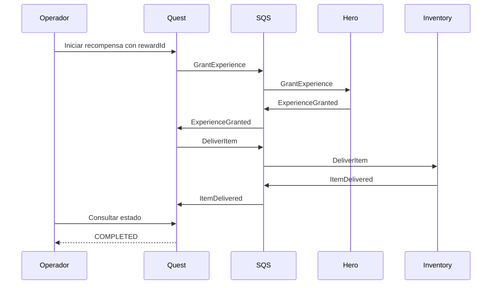
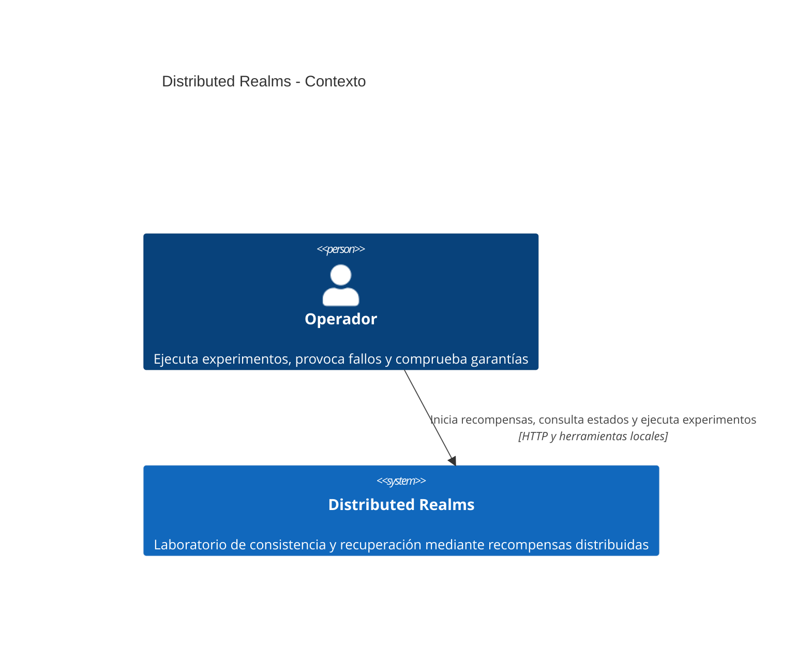
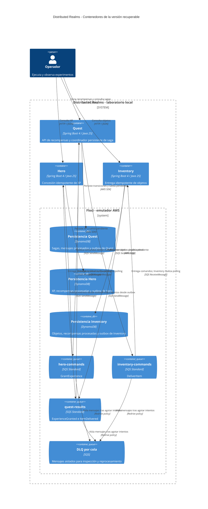
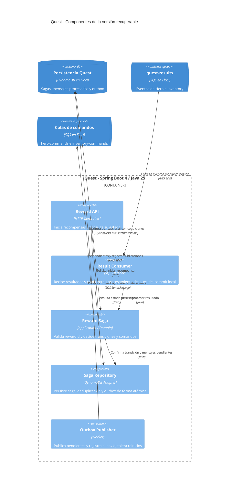

# Distributed Realms: laboratorio de consistencia y recuperación

## 1. Propósito

Distributed Realms es un laboratorio para aprender sistemas distribuidos en profundidad. Usa una recompensa de misión RPG como contexto concreto para estudiar consistencia, mensajería, fallos parciales y recuperación. No busca construir un RPG funcional ni enseñar programación.

El usuario tiene experiencia con backend, colas y servicios. El aprendizaje se concentra en las garantías de cada estrategia y en la evidencia que permite comprobarlas.

Cada laboratorio debe incluir una predicción, un fallo reproducible, observaciones del estado y un criterio verificable de resultado.

## 2. Alcance acordado

El primer laboratorio procesa una misión ya cumplida que concede una cantidad fija de XP y un objeto. No incluye objetivos de misión, combate, clases, habilidades, niveles ni interfaz de juego. El inventario tiene capacidad suficiente.

Reglas de negocio:

- Una recompensa tiene un `rewardId` estable y pertenece a un héroe.
- Cada recompensa concede XP una sola vez y entrega un objeto una sola vez.
- Si la XP fue concedida, un fallo posterior no la revierte.
- La entrega del objeto permanece pendiente hasta completarse.
- Los estados intermedios son válidos y deben ser observables.
- La finalización supone que los participantes y la infraestructura se recuperan y que la publicación y el procesamiento pendientes siguen ejecutándose.

La coordinación se implementa como una saga orquestada con recuperación hacia adelante. Las compensaciones se explorarán en un laboratorio posterior con operaciones que tengan una reversión de negocio definida.

## 3. Stack y ejecución

- Java 25 y Spring Boot 4 para los tres servicios.
- Floci como emulador AWS local.
- DynamoDB para persistencia.
- SQS para comandos y eventos de resultado.
- Un repositorio y tres procesos que puedan detenerse y reiniciarse de forma independiente.

Antes de implementar se comprobarán las versiones compatibles de las dependencias y las operaciones de DynamoDB y SQS requeridas en Floci. El emulador no constituye evidencia de equivalencia completa con AWS.

EventBridge y SNS quedan para experimentos posteriores de enrutamiento y distribución a varios consumidores. Event Sourcing y CQRS no son requisitos del primer laboratorio: la persistencia de la saga y de los resultados procesados debe permitir estudiar recuperación sin añadir esas variables desde el inicio.

## 4. Participantes y propiedad del estado

| Servicio | Responsabilidad | Estado persistido propio |
| --- | --- | --- |
| Quest | Crear la recompensa, coordinar sus pasos y registrar su finalización | Recompensa, estado de saga y mensajes procesados |
| Hero | Conceder XP y reconocer solicitudes repetidas | XP del héroe y resultado de cada recompensa procesada |
| Inventory | Entregar el objeto y reconocer solicitudes repetidas | Objetos entregados y resultado de cada recompensa procesada |

Cada servicio accede únicamente a sus tablas. Compartir una instancia local de DynamoDB no autoriza a consultar o modificar las tablas de otro participante.

Quest ofrece HTTP para iniciar una recompensa y consultar su estado. Las consultas de XP e inventario se realizan mediante las APIs de sus servicios. Las inspecciones directas de tablas se reservan para las herramientas del laboratorio.

## 5. Mensajes y flujo

Se emplean colas SQS Standard para hacer explícita la necesidad de tolerar reentregas y ausencia de orden global:

- `hero-commands`: comandos para Hero.
- `inventory-commands`: comandos para Inventory.
- `quest-results`: eventos de resultado para Quest.

Cada cola tendrá su propia DLQ para aislar mensajes que no puedan procesarse tras los intentos configurados. Un retraso o un servicio temporalmente caído no equivale a una cancelación de negocio. Los errores de negocio y los mensajes malformados deben distinguirse de los errores técnicos transitorios.

Flujo:

1. Quest registra la recompensa en `XP_PENDING` y solicita `GrantExperience`.
2. Hero concede la XP y emite `ExperienceGranted`.
3. Quest registra `ITEM_PENDING` y solicita `DeliverItem`.
4. Inventory entrega el objeto y emite `ItemDelivered`.
5. Quest registra `COMPLETED`.

El diagrama describe el flujo lógico; las garantías de persistencia y publicación dependen de la versión del laboratorio.

Sobre mínimo de cada mensaje:

- `messageId`: identidad estable del mensaje lógico, conservada al reintentar su publicación.
- `type` y `schemaVersion`: contrato del mensaje.
- `rewardId`: identidad de la operación de negocio y correlación de la saga.
- `causationId`: mensaje que originó esta respuesta o comando, cuando corresponda.
- `occurredAt`: instante de creación.
- `payload`: héroe, cantidad de XP u objeto según el contrato.

Un identificador de transporte SQS no sustituye a `messageId` ni a `rewardId`. Reutilizar un `rewardId` con datos de recompensa distintos debe producir un conflicto explícito.

## 6. Versión vulnerable: lab-01-vulnerable

Se conserva mediante una etiqueta Git, junto con instrucciones y herramientas que permitan reproducir el fallo.

La primera iteración debe ser una implementación razonable, vulnerable únicamente en las garantías que se estudian. Incluye validación de contratos, idempotencia de negocio por rewardId, protección condicional de transiciones, persistencia atómica local y confirmación del mensaje de entrada después de procesarlo y publicar el resultado. No confirma anticipadamente mensajes ni omite controles básicos para fabricar un fallo.

Su vulnerabilidad es la doble escritura: el estado de negocio y el envío a SQS se confirman por separado, sin outbox durable. Cada entrada de recompensa procesada conserva el resultado de negocio, pero no representa una publicación pendiente ni dispone de un proceso que la recupere. En una reentrega de una operación ya aplicada, el consumidor reconoce el duplicado y confirma la entrada sin volver a publicar su resultado. Este comportamiento evita repetir el efecto local, pero deja una brecha entre idempotencia local y recuperación del flujo distribuido.

El experimento principal controla la siguiente secuencia:

1. Hero recibe `GrantExperience` y confirma una transacción local que incrementa XP y registra rewardId como procesado.
2. Una barrera registra `BUSINESS_COMMITTED_BEFORE_RESULT_PUBLICATION` y detiene el flujo antes de publicar `ExperienceGranted` y antes de confirmar el comando de entrada.
3. El operador termina Hero, deja expirar el visibility timeout y lo reinicia con la interrupción desactivada.
4. Se verifica la reentrega del comando. Hero reconoce rewardId como procesado, no vuelve a conceder XP y confirma el mensaje sin emitir el resultado ausente.

Resultado esperado: una sola concesión de XP, Quest en `XP_PENDING`, ningún objeto entregado y ninguna publicación de `ExperienceGranted` originada por este comando. La reentrega ya no es una contingencia que invalida el experimento: es parte obligatoria de la demostración. Se registran commit, barrera, reentrega, detección del duplicado y confirmación, con rewardId y messageId.

La prueba usa barreras y condiciones observables, con un plazo acotado para comprobar la reentrega; no depende de acertar una ventana por tiempo ni pretende probar ausencia eterna de mensajes. Si no se observa la reentrega, el experimento queda inconcluso. Las reentregas adicionales tampoco deben reparar el resultado ausente bajo esta política.

Una política alternativa que vuelva a publicar el resultado al detectar una operación procesada puede recuperar esta ventana si conserva suficiente información. Se discutirá como comparación explícita: no se atribuye la pérdida a toda implementación sin outbox, sino a la combinación concreta de doble escritura y supresión de duplicados sin republicación. La versión vulnerable documenta esa decisión y sus límites.

La versión recuperable conserva los controles de esta primera iteración y añade el registro transaccional y la recuperación de publicaciones pendientes. La comparación debe aislar esa mejora, sin cambiar reglas de negocio ni eliminar controles de la primera versión.
## 7. Versión recuperable: lab-02-recoverable

Mantiene el mismo caso de negocio y contratos para repetir los experimentos con garantías adicionales.

### Persistencia y outbox

Cada participante guarda en una sola transacción DynamoDB:

- El cambio de negocio o de estado de saga.
- El registro necesario para reconocer la operación procesada.
- Los mensajes de salida pendientes en una outbox.

La escritura usa condiciones que impiden aplicar dos veces una operación concurrente. El consumidor confirma el mensaje de entrada después de confirmar la transacción local.

Un publicador recuperable envía las entradas pendientes de la outbox y registra su publicación después del envío. Puede publicar dos veces si cae entre enviar y registrar el resultado; los consumidores deben tolerarlo. Su selección de pendientes, coordinación y política de reintentos se concretarán en el plan de implementación.

### Publicadores concurrentes

Dos workers pueden seleccionar la misma entrada pendiente. La corrección no puede depender de ejecutar un único publicador. El contrato mínimo permite envíos repetidos de la misma entrada, siempre conservando su `messageId` y contenido, y exige que no se pierdan pendientes ni se marquen como publicados antes de un envío exitoso.

El experimento sincroniza dos workers después de seleccionar la misma entrada y antes de enviarla. Ambos se liberan mediante una barrera; se registran selección, intento, respuesta del envío y actualización de estado por worker. Se comprueba que los duplicados no generan otro efecto de negocio ni otra transición de saga y que el estado de publicación converge. Se repite deteniendo un worker después de enviar y antes de registrar la publicación.

Una reclamación condicional con lease puede reducir envíos simultáneos; no elimina duplicados cuando un envío ya ocurrió o un worker sigue trabajando después de expirar su lease. Si el plan adopta leases, debe definir propietario, vencimiento y actualización condicional por propietario, y añadir un caso de recuperación de una reclamación abandonada. No se atribuye exclusividad al transporte ni entrega exactamente una vez a este mecanismo.
### Idempotencia y transiciones

- Hero reconoce `GrantExperience` por `rewardId` y no suma XP otra vez.
- Inventory reconoce `DeliverItem` por `rewardId` y no crea otro objeto.
- Quest procesa resultados únicamente mediante transiciones válidas y condicionales.
- Un resultado duplicado o tardío no hace retroceder la saga ni crea una nueva acción de negocio.
- Los resultados procesados y registros de deduplicación se conservan durante el laboratorio; no se introduce TTL que permita duplicar una recompensa antigua.
- Repetir la solicitud HTTP con el mismo `rewardId` y contenido devuelve la recompensa existente.

Se distinguen tres protecciones independientes:

| Protección | Identidad o condición | Qué impide |
| --- | --- | --- |
| Deduplicación de mensajes | `messageId` | Procesar otra vez el mismo mensaje lógico |
| Idempotencia de negocio | `rewardId` y operación | Conceder dos veces XP o entregar dos veces el objeto, incluso con messageId distintos |
| Protección de transición | Estado esperado y versión persistida de saga | Avanzar dos veces o retroceder por resultados duplicados, tardíos o concurrentes |

Ejemplo obligatorio: dos `ExperienceGranted` con messageId distintos y el mismo rewardId llegan a Quest. Solo la transición condicional `XP_PENDING -> ITEM_PENDING` puede crear el comando lógico `DeliverItem`. El cambio de estado y la creación de su entrada de outbox se confirman juntos. Si Quest ya está en `ITEM_PENDING` o `COMPLETED`, el segundo evento compatible no crea otra entrada. Un resultado con contenido contradictorio o incompatible con el estado debe registrarse como anomalía y tratarse explícitamente, sin avanzar silenciosamente la saga.
No se promete entrega de transporte exactamente una vez. Se busca que las reentregas produzcan un único efecto de negocio.

### Recuperación y observabilidad

La saga y las outboxes sobreviven al reinicio. Los servicios exponen estado suficiente para comprobar XP, objeto, paso pendiente y publicaciones pendientes. Los registros incluyen `rewardId`, `messageId`, servicio y transición.

Distinguir una recompensa pendiente de una bloqueada requiere observar intentos y errores. El primer laboratorio debe permitir inspección y reprocesamiento explícito de una DLQ; mover un mensaje a DLQ no completa ni cancela la saga.

## 8. Experimentos y criterios de aceptación

Cada ejecución parte de datos identificables y registra el estado inicial. Se usan puntos de interrupción controlados, no esperas arbitrarias para intentar acertar una ventana de fallo.

| Experimento | Comprobación |
| --- | --- |
| Flujo sin fallos | Saga completa, incremento esperado de XP y un objeto asociado a rewardId |
| Caída después del commit local y antes de publicar y confirmar entrada | Reentrega obligatoria: vulnerable suprime el duplicado sin republicar y queda pendiente; recuperable publica desde outbox y completa |
| Reentrega de comando ya aplicado | Ambas versiones conservan una sola concesión de XP y un solo objeto; se compara recuperación del resultado ausente |
| Caída después de publicar y antes de marcar outbox | Puede repetirse el mensaje, pero no su efecto de negocio |
| Comando duplicado, también concurrente | En ambas versiones hay una concesión de XP y un objeto |
| Resultado duplicado o tardío, con messageId iguales y distintos | Una transición válida y una entrada lógica DeliverItem; también ante procesamiento concurrente |
| Dos publicadores seleccionan la misma entrada | Barrera fuerza la carrera; se conservan identidad y contenido, no se pierde el pendiente y no se duplica el efecto |
| Un publicador concurrente cae después del envío | Otro worker puede completar o repetir la publicación; saga y efectos permanecen únicos |
| Reinicio de Quest durante la saga | Continúa desde el estado persistido sin depender de memoria local |
| Inventory fuera de servicio | XP permanece concedida; al recuperarse Inventory, se entrega el objeto y completa la saga |

La finalización se comprueba con consultas acotadas por un plazo de prueba, sin afirmar una latencia garantizada del sistema. El resultado incluye estado final y evidencia de la secuencia de mensajes y transacciones relevantes.

## 9. Conservación de los laboratorios

- `lab-01-vulnerable`: código, configuración e instrucciones del experimento vulnerable.
- `lab-02-recoverable`: mismo escenario con outbox e idempotencia.
- Cada etiqueta debe contener un entorno local reproducible con versiones de dependencias e imagen Floci fijadas.
- La comparación debe explicar qué cambió y qué fallo resuelve cada mecanismo.
- No se mezclan ambos comportamientos mediante un interruptor en el código de negocio.

## 10. Etapas posteriores

Se conservan como temas de exploración, fuera del primer laboratorio:

1. Fallos de negocio, capacidad de inventario, buzón y compensaciones explícitas.
2. Timeouts, respuestas tardías y recuperación operativa. Las fechas límite se evalúan explícitamente; TTL se reserva para limpieza.
3. Comparación de orquestación con coreografía.
4. Event Sourcing, reconstrucción de agregados, CQRS y reconstrucción de proyecciones.
5. Raids: concurrencia bajo carga, OCC, escrituras atómicas y comparación con procesamiento serializado.
6. EventBridge, SNS y distribución a múltiples consumidores.
7. Inyección de fallos más amplia y observabilidad entre servicios.

## 11. Estado y siguiente paso

- [x] Propósito y alcance discutidos.
- [x] Repositorio Git local creado.
- [x] Diseño del primer laboratorio documentado.
- [ ] Revisión de esta especificación.
- [ ] Plan de implementación, incluida verificación de compatibilidad con Floci.
- [ ] Versión vulnerable implementada y experimento verificado.
- [ ] Versión recuperable implementada y experimentos verificados.

Todavía no existe código de producto ni infraestructura ejecutable en este repositorio.

## 12. Arquitectura C4

Los diagramas C4 complementan el flujo de mensajes: muestran los límites del sistema, los procesos ejecutables y las responsabilidades internas. Describen el diseño objetivo de la versión recuperable; no indican que exista implementación.

### Nivel 1: contexto del sistema

Floci es infraestructura local del laboratorio, representada en el nivel de contenedores. En este nivel se muestra la relación del operador con el sistema completo.

### Nivel 2: contenedores

Quest, Hero e Inventory son procesos independientes. Las tablas tienen propietarios distintos aunque residan en el mismo emulador. Las outboxes y los registros de operaciones procesadas pertenecen al servicio que los escribe.

La caja de DLQ agrupa visualmente tres colas distintas. El operador también inspecciona tablas, colas y registros mediante herramientas del laboratorio; esos accesos operativos no forman parte de las APIs de negocio.

### Nivel 3: componentes de Quest

El coordinador decide transiciones y mensajes de salida. El repositorio confirma el cambio de saga, deduplicación y outbox en una transacción local. El publicador de outbox se ejecuta dentro del proceso Quest y puede recuperarse al reiniciar.

Hero e Inventory mantienen la misma separación entre consumidor, lógica de negocio, persistencia transaccional y publicador de outbox. Sus reglas de negocio son, respectivamente, conceder XP y entregar un objeto una sola vez por recompensa.

### Diferencia arquitectónica de la versión vulnerable

Los límites de procesos, las colas y la propiedad del estado se conservan. En `lab-01-vulnerable`, la aplicación persiste estado e idempotencia local y publica directamente, sin outbox durable. Las reentregas reconocidas como duplicados se confirman sin republicar el resultado. En `lab-02-recoverable`, los componentes de persistencia transaccional y publicación recuperable cierran esa ventana; no se requiere cambiar el contrato de negocio.

El nivel 4 de C4 queda fuera de esta especificación: la estructura concreta del código se decidirá en el plan de implementación.
